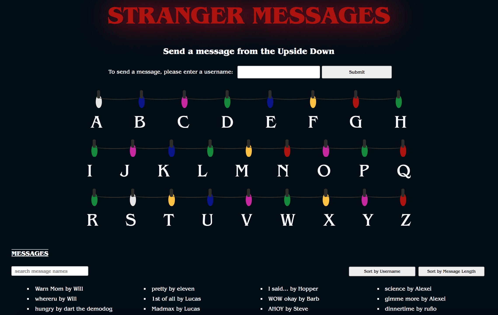

# Stranger Messages

A place to send messages from the Upside Down. 

Stranger Messages is a SPA built with JavaScript, CSS, and HTML on the frontend and a Rails API on the backend. This is inspired by Netflix's <a href="https://www.netflix.com/title/80057281">Stranger Things</a>.

### Features
* Users may create messages to be played out by the light wall or play messages sent by other users

### Getting Started
* fork and clone repo
* run bundle install
* cd into `stranger_messages_backend` 
* to start server, run `rails s`
* in a new terminal tab, cd into `stranger_messages_frontend` 
* run `open index.html`

### Acknowledgements
css lights adapted from <a href="https://codepen.io/tobyj/pen/QjvEex">Pure CSS Christmas Lights by tobyj</a>

### License
<a href="https://github.com/Waffles4Ransom/stranger_messages/blob/master/LICENSE">MIT License</a>